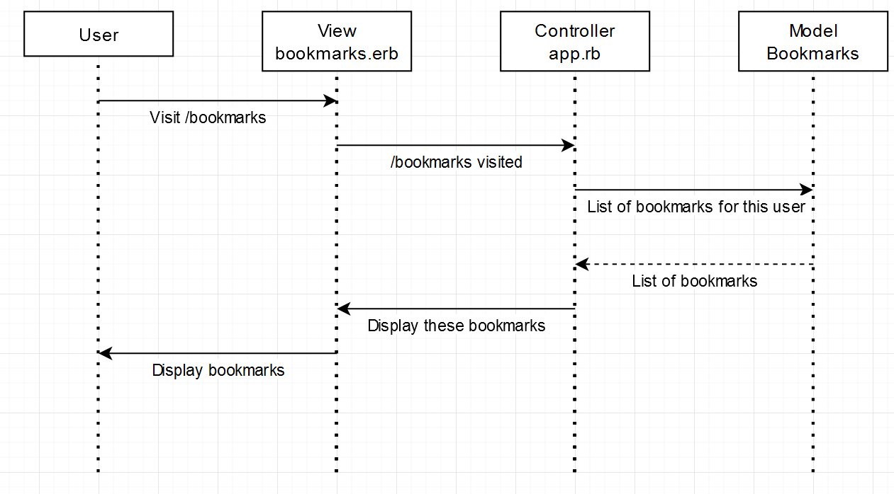

# Bookmark Manager

## Summary
A database-backed Sinatra web application to allow users to sign-in and track their bookmarks.

## User requirements

```
As a busy user, 
so that I can keep track all my browser tabs, 
I want to see all my bookmarks.
```

## Domain Models


## How to use

### To set up the project
Clone this repo and cd to the directory then run:
```
bundle
```

### To set up the database

 Connect to `psql` and create the `bookmark_manager` database:

 ```
 CREATE DATABASE bookmark_manager;
 ```

 To set up the appropriate tables, connect to the database in `psql` and run the SQL scripts in the `db/migrations` folder in the given order.
